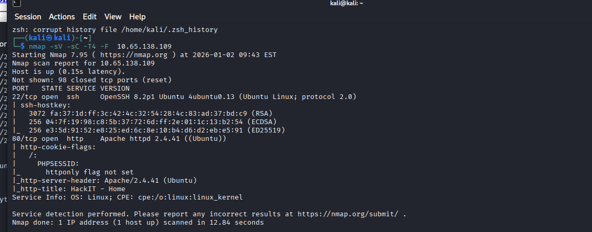
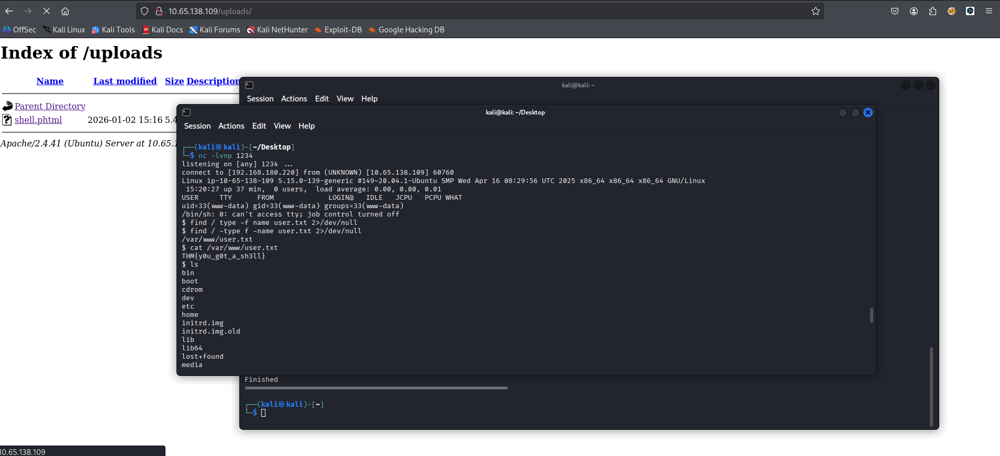

# TryHackMe - RootMe Room Walkthrough

This repository contains a step-by-step walkthrough of the **"RootMe"** CTF (Capture The Flag) room on TryHackMe. This is a beginner-level challenge focusing on basic enumeration, web exploitation, and Linux privilege escalation.

The methodology follows a standard penetration testing kill chain: Enumeration, Initial Access, and Privilege Escalation.

## 🛠️ Tools Used
* **Nmap:** For network discovery and port scanning.
* **Gobuster:** For enumerating hidden directories on the web server.
* **Netcat (nc):** For catching the reverse shell connection.
* **Python:** For exploiting SUID permission to gain root access.

---

## Phase 1: Reconnaissance & Enumeration

### Nmap Scan
I started with a comprehensive Nmap scan to identify open ports and running services on the target machine. The following command was used to scan all ports and detect versions:

`nmap -sC -sV -p- -T4 -F  <TARGET_IP>`

**Result:** The scan revealed Port 22 (SSH) and **Port 80 (HTTP - Apache Web Server)** were open. I focused my attention on Port 80 as the primary entry vector.

### Web Directory Enumeration with Gobuster
Used Gobuster to find hidden directories and pages on the web server that were not linked on the homepage.

`gobuster dir -u http://<TARGET_IP> -w /usr/share/wordlists/dirbuster/directory-list-2.3-medium.txt -t 100`

**Result:** Two critical directories were discovered:
* `/panel/`: An upload page.
* `/uploads/`: The directory where uploaded files are stored.

---

## Phase 2: Initial Access

I targeted the upload form located at `/panel/` to gain a foothold on the system.

1.  **Bypassing Filters:** I attempted to upload a standard PHP reverse shell script. The server had a filter blocking `.php` extensions. I bypassed this filter by renaming the payload extension to **`.phtml`**, which was successfully uploaded.
2.  **Reverse Shell:** I started a Netcat listener on my attack machine to catch the incoming connection:
    `nc -lvnp 1234`
3.  I triggered the payload by navigating to `/uploads/shell.phtml` in the web browser, resulting in a low-privileged shell (www-data).

* **User Flag:** Once inside, I located the first flag using `find / -name user.txt 2>/dev/null`.

---

## Phase 3: Privilege Escalation

Now having limited access, I looked for ways to escalate privileges to the root user.

### SUID Exploitation
I searched the system for files with the **SUID (Set User ID)** bit set using the following command:

`find / -user root -perm -u=s -type f 2>/dev/null`

**Result:** The output showed an interesting file that typically shouldn't have SUID permissions: **`/usr/bin/python`**.

Since Python had SUID set, it could run with root privileges. Leveraging a technique from **GTFOBins**, I executed the following command to spawn a root shell through Python:

`/usr/bin/python -c 'import os; os.execl("/bin/sh", "sh", "-p")'`

Upon execution, I successfully elevated to **Root** user and captured the final flag located at `/root/root.txt`.

---

## 🏆 Conclusion

The RootMe room was excellent practice for understanding basic web vulnerabilities (insecure file upload) and misconfigured Linux permissions (SUID). The system was successfully enumerated, filters were bypassed to gain initial access, and a critical configuration error was exploited to fully compromise the machine.
